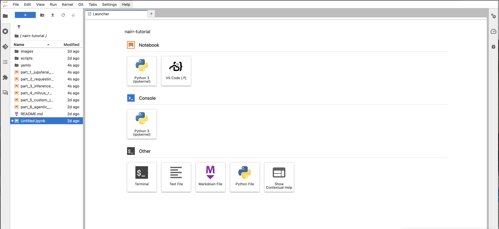
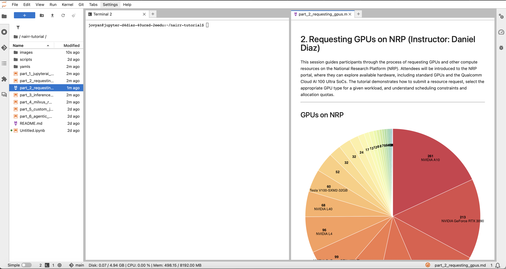

# NRP and Kubernetes for Education and Research

This tutorial covers using the National Research Platform (NRP) Kubernetes cluster for education and research: logging in to the hosted JupyterHub, opening a terminal that talks to the cluster, exploring resources, and creating the Kubernetes objects researchers and educators reach for daily — Pods, PersistentVolumeClaims, multi-container (sidecar) Pods, ConfigMaps + Secrets, Deployments, Batch Jobs, an HTTPS-fronted Service via Ingress, and GPU pods. Along the way you'll learn `kubectl cp` / `port-forward` / `patch`, plus how scheduling primitives (node labels, affinity, taints, tolerations) let you steer pods onto the workshop's reserved GPU pool.

<!--
**Conventions:** Hands-on examples use the **`nrp-training-k8s`** namespace; create it with `kubectl create namespace nrp-training-k8s` if it does not already exist. In any YAML or command, replace **`<username>`** with your NRP or GitHub username to avoid name collisions.
-->

YAMLs referenced in this tutorial live in this directory's [`yamls/`](yamls) folder.

> 📘 **Docs:** [Getting started](https://nrp.ai/documentation/userdocs/start/getting-started/) · [Kubernetes basics](https://nrp.ai/documentation/userdocs/tutorial/basic/) · [GPU pods](https://nrp.ai/documentation/userdocs/running/gpu-pods/) · [Run jobs](https://nrp.ai/documentation/userdocs/running/jobs/) · [Storage](https://nrp.ai/documentation/userdocs/storage/intro/) · [JupyterHub](https://nrp.ai/documentation/userdocs/jupyter/jupyterhub-service/) · [Live resources](https://nrp.ai/viz/resources/)

# Interacting with NRP


The majority of NRP users interact with the cluster using the following three methods.
- **Kubernetes**: Directly submit and manage containerized workloads (services and batch jobs) using Kubernetes APIs and tools like `kubectl`.
- **Coder**: Launch a browser-based VS Code environment connected to cluster resources for interactive development and execution.
- **Jupyterhub**: Start a JupyterLab notebook server on the cluster for interactive analysis, prototyping, and teaching workflows.

Today, we will be using two of these services. We will launch a jupyterhub server. From the jupyterhub server, we will interact with kubernetes directly using the hub's terminal. 

If you have not already done so, please use the following link to [Launch the Tutorial Workspace](https://training.nrp-nautilus.io/hub/user-redirect/git-pull?repo=https%3A%2F%2Fgithub.com%2Fnrp-nautilus%2F7nrp&branch=main&urlpath=lab%2Ftree%2F7nrp%2F)

<div style="text-align:center;">
  
</div>

- When you launch your notebook, you should see a screen like this.
- Let's set up our workspace to view these instructions and the terminal. 

<div style="text-align:center;">
  
</div>


---

## Introduction to the National Research Platform (NRP)

The National Research Platform (NRP) is a partnership of more than 50 institutions, led by researchers and cyberinfrastructure professionals at UC San Diego, University of Nebraska-Lincoln, and the Massachusetts Green High Performance Computing Center (MGHPCC). The NRP provides an open, nationally distributed cyberinfrastructure built on a Kubernetes cluster named **Nautilus**.

Nautilus pools heterogeneous hardware components — spanning compute, storage, and specialized accelerators like NVIDIA GPUs and Qualcomm Cloud AI devices — from contributing partners into a unified computing framework. Researchers access these resources through namespaces, allocating storage, running persistent applications, or executing temporary batch jobs.

### Available Compute Resources

Nautilus features a wide variety of computational resources:
- Standard x86 CPUs and high-memory CPU nodes.
- Diverse **NVIDIA GPUs** (e.g., A10, A100, RTX 3090/4090, H100) accessible for demanding parallel computing tasks and machine learning.
- Advanced hardware accelerators like **Qualcomm Cloud AI 100 Ultra SoCs** natively mapped as standard Kubernetes resources via Device Plugins.

### Storage and Namespaces

By default, your work executes within Kubernetes **Namespaces**. These virtual partitions securely isolate compute workloads and data allocation models across distinct projects. A typical workload utilizes **Persistent Volume Claims (PVCs)** built mostly upon Ceph instances distributed globally. This mechanism allows stateful data generation mapped safely against node eviction policies.

### Scale

- **500+ nodes**
- **1500+ GPUs**
- **50+ FPGAs**

### Capabilities

- **Storage:** CephFS, CVMFS, S3
- **Monitoring:** PerfSONAR, traceroute, Prometheus
- **Compute and data tools:** JupyterHub, WebODM, GitLab, Nextcloud, Overleaf
- **Collaboration tools:** Jitsi, EtherPad, HedgeDoc, Syncthing

### Operational history

The Nautilus cluster has been in continuous operation for **6 years**. Its control plane manages worker nodes that run pods and provide the Kubernetes runtime environment.

---

## Hosted JupyterHub at a glance

NRP runs a [hosted JupyterHub](https://jupyterhub-west.nrp-nautilus.io) you can use with your institutional credentials (CILogon). After logging in, choose the hardware profile for your instance and start running notebooks — no Kubernetes required to begin.

Your home directory (`/home/jovyan`) is a persistent volume, **50GB** by default; don't fill it up or your next Jupyter session may not start. You can request more space or use [CephFS](https://nrp.ai/documentation/userdocs/storage/ceph) for larger or shared workloads. The server will shut down about **1 hour** after your browser disconnects, so keep a tab open or use a stable connection if you need long-running work.

For available images and custom setups, see the [scientific images](https://nrp.ai/documentation/userdocs/running/sci-img/) guide and [TensorFlow with Jupyter](https://nrp.ai/documentation/userdocs/jupyter/jupyter-pod/). More detail: [JupyterHub service](https://nrp.ai/documentation/userdocs/jupyter/jupyterhub-service/).

**Hands-on:** Open [JupyterHub](https://jupyterhub-west.nrp-nautilus.io) (or [training JupyterHub](https://training.nrp-nautilus.io) for the tutorial), log in with CILogon, and spawn an instance with your chosen profile to start using the platform.

---

## Interacting with NRP

The majority of NRP users interact with the cluster using one of three methods:

- via **Kubernetes**: directly submit and manage containerized workloads (services and batch jobs) using Kubernetes APIs and tools like `kubectl`.
- via the **Coder** service: launch a browser-based VS Code environment connected to cluster resources for interactive development and execution.
- via the NRP-deployed **JupyterHub**: start a JupyterLab notebook server on the cluster for interactive analysis, prototyping, and teaching workflows.

In this tutorial we focus on `kubectl`. You have **two ways** to run it for the workshop — pick whichever fits how you like to work:

### Option 1 — Use the training JupyterHub (zero install, recommended)

The workshop hub at [https://training.nrp-nautilus.io](https://training.nrp-nautilus.io) is pre-configured: every spawned JupyterLab pod has `kubectl` installed and a kubeconfig wired to the same `jupyterhub-sa` identity. Open a terminal in JupyterLab and start running `kubectl` immediately — no install, no kubeconfig to manage. **Recommended for the workshop.**

### Option 2 — kubectl on your laptop

Use this if you prefer your own terminal. The workshop kubeconfig carries the `jupyterhub-sa` service-account token, the cluster CA, and `nrp-training-k8s` as the default namespace. The embedded token is valid for the duration of 7NRP, through end-of-day Thursday, May 7, 2026.

Three universal copy-paste commands — install `kubectl`, install `helm`, then add the workshop kubeconfig. None of them assume you have cloned this repo locally.

**macOS / Linux**

1. Install `kubectl`:

```bash
OS=$(uname | tr '[:upper:]' '[:lower:]') \
&& ARCH=$(uname -m | sed 's/x86_64/amd64/;s/aarch64/arm64/') \
&& curl -fsSLo /tmp/kubectl "https://dl.k8s.io/release/v1.33.0/bin/${OS}/${ARCH}/kubectl" \
&& sudo install -m 0755 /tmp/kubectl /usr/local/bin/kubectl \
&& rm /tmp/kubectl \
&& kubectl version --client
```

2. Install `helm`:

```bash
OS=$(uname | tr '[:upper:]' '[:lower:]') \
&& ARCH=$(uname -m | sed 's/x86_64/amd64/;s/aarch64/arm64/') \
&& curl -fsSL "https://get.helm.sh/helm-v3.16.4-${OS}-${ARCH}.tar.gz" | tar -xz -C /tmp/ \
&& sudo install -m 0755 "/tmp/${OS}-${ARCH}/helm" /usr/local/bin/helm \
&& rm -rf "/tmp/${OS}-${ARCH}" \
&& helm version --short
```

3. Add the workshop kubeconfig (download into `~/.kube/`, merge into your default config, and switch context):

```bash
mkdir -p ~/.kube \
&& curl -fsSLo ~/.kube/nrp-training.kubeconfig https://raw.githubusercontent.com/nrp-nautilus/7nrp/main/files/nrp-training.kubeconfig \
&& chmod 600 ~/.kube/nrp-training.kubeconfig \
&& KUBECONFIG=~/.kube/config:~/.kube/nrp-training.kubeconfig kubectl config view --flatten > ~/.kube/config.merged \
&& mv ~/.kube/config.merged ~/.kube/config && chmod 600 ~/.kube/config \
&& kubectl config use-context nrp-training-k8s \
&& kubectl auth whoami
```

**Windows (PowerShell)**

1. Install `kubectl`:

```powershell
winget install -e --id Kubernetes.kubectl ; kubectl version --client
```

2. Install `helm`:

```powershell
winget install -e --id Helm.Helm ; helm version --short
```

3. Add the workshop kubeconfig:

```powershell
New-Item -ItemType Directory -Force -Path "$HOME\.kube" | Out-Null ; `
Invoke-WebRequest -Uri "https://raw.githubusercontent.com/nrp-nautilus/7nrp/main/files/nrp-training.kubeconfig" -OutFile "$HOME\.kube\nrp-training.kubeconfig" ; `
$env:KUBECONFIG = "$HOME\.kube\config;$HOME\.kube\nrp-training.kubeconfig" ; `
kubectl config view --flatten | Out-File -Encoding ASCII "$HOME\.kube\config.merged" ; `
Move-Item -Force "$HOME\.kube\config.merged" "$HOME\.kube\config" ; `
$env:KUBECONFIG = "$HOME\.kube\config" ; `
kubectl config use-context nrp-training-k8s ; `
kubectl auth whoami
```

After these three commands, `kubectl auth whoami` should print `system:serviceaccount:nrp-training:jupyterhub-sa`. Your default namespace is now `nrp-training-k8s` for every subsequent `kubectl` call — switch back to your prior context any time with `kubectl config use-context <name>`.

> **After the workshop ends:** this kubeconfig stops working. For ongoing NRP Nautilus access, configure `kubelogin` to use your personal **CILogon** identity instead of this temporary service account. Follow the official getting-started guide: <https://nrp.ai/documentation/userdocs/start/getting-started/>.

---

## GPUs on NRP

There are many types of GPU available on NRP. You can view live availability of all resources at [https://nrp.ai/viz/resources/](https://nrp.ai/viz/resources/).

### Hands-on: Explore GPU options on NRP

```bash
# print list of NRP nodes with GPU label
kubectl get nodes -L nvidia.com/gpu.product
```

<details>
  <summary>Click to reveal sample output</summary>

```
NAME                                         STATUS   ROLES            AGE      VERSION    GPU.PRODUCT
aarch64.calit2.optiputer.net                 Ready    <none>           2y234d   v1.33.8
admiralty-ncmir-mm-expanse-7d43bc97a0        Ready    cluster,master   13d
cenic-nrp1.hpc.cpp.edu                       Ready    <none>           17d      v1.33.8    NVIDIA-RTX-A6000
chi-dgx-node01.csuchico.edu                  Ready    <none>           165d     v1.33.8    Tesla-V100-SXM2-16GB
clu-fiona2.ucmerced.edu                      Ready    <none>           122d     v1.33.8    NVIDIA-GeForce-GTX-1080-Ti
```
</details>

---

## Kubernetes basics (quick intro)

Kubernetes is a system for running applications on a cluster by managing **workloads** (things you want to run) and keeping them in the desired state.

Most interactions with Kubernetes involve creating and updating **resources** (objects) described in **YAML**.
- A YAML "manifest" declares the *desired state* (what you want running).
- Kubernetes works continuously to make the cluster match that desired state.

Typical workflow:
1. Write or edit a YAML manifest.
2. Apply it to the cluster (e.g., `kubectl apply -f ...`).
3. Check status and troubleshoot (pods, logs, events).

### Kubernetes workloads

Workloads are the resource types you use to run containers on the cluster.

- **Pod**: the basic unit where your application runs (one or more containers together).
- **Job**: runs work to completion (batch or one-off tasks).
- **Deployment**: manages long-running services and keeps them available (including rolling updates).

Rule of thumb:
- Use a **Job** when the work should finish.
- Use a **Deployment** when the work should keep running.

### Hardware acceleration

Kubernetes requires specialized extensions to manage and assign non-CPU hardware.
- **GPUs in Kubernetes**: workloads can explicitly request NVIDIA GPUs (e.g. `nvidia.com/gpu`) by specifying resource limits in their deployment manifests.
- **Device Plugins**: software components that advertise specialized hardware resources to the Kubernetes scheduler. For example, Qualcomm Cloud AI devices are exposed through a device plugin natively mapping as `qualcomm.com/qaic`.

### Keep in mind

- Pods are **ephemeral**. Once a pod is terminated all data is deleted.
- **Persistent Volume Claims** (PVCs) are used to claim long-term storage.
- Kubernetes nodes are typically not accessed directly by users. Instead, users define their workloads in YAML files and submit them to the cluster using `kubectl`, which can be run from any machine that has it installed (such as a local computer or a JupyterHub terminal).

### Docker and containers

Docker is a tool for building and running **containers**. A container image packages:
- your application code,
- libraries and dependencies,
- enough operating-system files to run consistently.

This makes the environment portable: the same image can run on your laptop, a VM, or on a Kubernetes cluster.

#### Why Docker matters for Kubernetes

Kubernetes runs **container images**. It does not build them. In practice:
- You build a container image (with Docker or another tool).
- Kubernetes pulls that image and runs it as part of your workload.

#### Container registries

A **container registry** stores and distributes container images.
- Public example: Docker Hub.
- Organizations often use private registries for internal images.

NRP note:
- NRP GitLab provides a container registry (public or private depending on repo settings).
- You can push local images to GitLab's registry, or build/publish images using GitLab CI/CD.

---

## Hands-on: kubectl basics and a simple pod

In this section we go through some common `kubectl` commands and create some Kubernetes objects.

YAML files are in this directory's [`yamls/`](yamls) folder. Find `test-pod.yaml` and open it in the editor.

### Creating a simple pod

Edit `yamls/test-pod.yaml` to give the pod a unique **name**.

```yaml
apiVersion: v1
kind: Pod
metadata:
  name: test-pod-<username>
spec:
  containers:
  - name: mypod
    image: ubuntu
    resources:
      limits:
        memory: 100Mi
        cpu: 100m
      requests:
        memory: 100Mi
        cpu: 100m
    command: ["sh", "-c", "echo 'Hello from NRP!' && sleep 3600"]
```

Launch this pod:

```bash
kubectl apply -f yamls/test-pod.yaml
```

Check whether you were successful:

```bash
kubectl get pods
# get detailed pod information
kubectl get pod test-pod-<username> -o wide
```

Look at the logs associated with this pod:

```bash
kubectl logs test-pod-<username>
```

View detailed pod information:

```bash
kubectl describe pod test-pod-<username>
```

Execute a command in the pod:

```bash
kubectl exec test-pod-<username> -- echo 'Command executed successfully'
```

Get an interactive shell into the pod:

```bash
kubectl exec -it test-pod-<username> -- /bin/bash
```

Finally, clean up the pod to free resources:

```bash
kubectl delete pod test-pod-<username>
```

---

## Monitoring

We collect many metrics in real time to help users evaluate the performance of their workloads. Dashboards (historical and live) are on Grafana:

- [Grafana dashboards](https://grafana.nrp-nautilus.io/dashboards)
- [Grafana: namespace pod dashboard](https://grafana.nrp-nautilus.io/d/85a562078cdf77779eaa1add43ccec1e/kubernetes-compute-resources-namespace-pods)
- [Grafana: namespace GPU dashboard](https://grafana.nrp-nautilus.io/d/dRG9q0Ymz/k8s-compute-resources-namespace-gpus)

Many clusters have an acceptable use policy (including NRP). The most important thing to keep in mind is that **NRP is a shared resource**. Ensure that any resource you request is used efficiently and release the resource when you are done.

At NRP we aim for the utilization of user pods to have GPU > 40%, CPU 20–200%, RAM 20–150% of requested amount.

Cluster usage policies: [https://nrp.ai/documentation/userdocs/start/policies/](https://nrp.ai/documentation/userdocs/start/policies/).

---

## Hands-on: Persistent storage with a PVC

Pods are ephemeral — anything written to the container filesystem disappears when the pod terminates. **PersistentVolumeClaims** (PVCs) ask Kubernetes for a block of long-lived storage you can mount into pods. On NRP we typically use the `rook-ceph-block-east` storage class for general-purpose `ReadWriteOnce` block storage.

Open `yamls/pvc.yaml`. It contains both a 1 GiB PVC and a small writer pod that mounts it at `/data`. Replace `<username>` in both names, then apply:

```bash
kubectl apply -f yamls/pvc.yaml
kubectl get pvc
kubectl get pod pvc-pod-<username>
```

The PVC starts in `Pending` and flips to `Bound` once the volume is provisioned. Watch the writer pod append a line to the volume on every restart, then read it back:

```bash
kubectl logs -f pvc-pod-<username>
# in another terminal:
kubectl exec pvc-pod-<username> -- cat /data/log.txt
```

Now delete the pod and recreate just the pod (not the PVC) to prove the data survives. The simplest way is to delete only the pod and re-apply:

```bash
kubectl delete pod pvc-pod-<username>
kubectl apply -f yamls/pvc.yaml          # recreates the pod; the PVC is unchanged
kubectl exec pvc-pod-<username> -- cat /data/log.txt   # the previous line is still there
```

**Don't delete the PVC yet** — the next section reuses `pvc-<username>` to demonstrate a multi-container pod. If you're skipping ahead, clean up with `kubectl delete -f yamls/pvc.yaml`.

> **Storage classes on NRP.** `rook-ceph-block-east` (RWO) is the default for single-pod block storage. For shared `ReadWriteMany` workloads use a CephFS class (`rook-cephfs`). See the [storage docs](https://nrp.ai/documentation/userdocs/storage/intro/) for the full list and when to use each.

---

## Hands-on: Multi-container pod (sidecar pattern, shared volume)

A pod can hold more than one container — they share the network namespace (same `localhost`) and any volumes you mount into both. This is the classic **sidecar** pattern: one container does the main job, a second container does something supporting (log shipping, file syncing, format conversion). Each container has its own logs, its own image, and its own resource requests.

`yamls/multicontainer.yaml` defines a pod with two containers that share the `pvc-<username>` claim from the previous section:
- **`writer`** appends a tick line to `/shared/data.log` every 5 seconds, and also echoes each tick to its own stdout.
- **`reader`** tails the same file from a different process and streams whatever shows up to **its** own stdout.

Before applying, delete the writer pod from the PVC section so the volume detaches — `rook-ceph-block-east` is `ReadWriteOnce`, so two pods on different nodes cannot mount it simultaneously:

```bash
kubectl delete pod pvc-pod-<username> --ignore-not-found
```

Replace `<username>` in `multicontainer.yaml` (in the pod name **and** in `claimName`), then apply:

```bash
kubectl apply -f yamls/multicontainer.yaml
kubectl get pod sidecar-<username>
```

`READY` shows `2/2` once both containers are running. Inspect the container list:

```bash
kubectl get pod sidecar-<username> -o jsonpath='{.spec.containers[*].name}'
# → writer reader
```

Now read each container's log stream **separately** with `-c`:

```bash
kubectl logs sidecar-<username> -c writer  --tail=5
kubectl logs sidecar-<username> -c reader  --tail=5
# follow one of them in real time
kubectl logs -f sidecar-<username> -c reader
```

The reader's output proves both containers see the same file: every line the writer appends shows up in the reader's stream within a couple of seconds. Default `kubectl logs sidecar-<username>` (no `-c`) only works on single-container pods; on a multi-container pod kubectl will refuse and ask you to pick.

Clean up — this also releases the PVC if you no longer need it:

```bash
kubectl delete -f yamls/multicontainer.yaml
kubectl delete -f yamls/pvc.yaml
```

> **Why use a multi-container pod instead of two pods?** Two pods are isolated — no shared filesystem, no shared `localhost`. Use a single pod with two containers when the workloads are tightly coupled (a model server + its prometheus exporter, a training loop + a checkpoint shipper). Use separate pods otherwise.

---

## Hands-on: Configuration with ConfigMap, Secret, and env vars

Hard-coding paths, hostnames, or API tokens into images is a recipe for pain. Kubernetes gives you two purpose-built objects:
- **ConfigMap** — non-sensitive key/value config (hostnames, paths, feature flags). Stored as plain text in etcd.
- **Secret** — sensitive values (tokens, passwords, TLS keys). Stored base64-encoded in etcd, with separate RBAC; tooling treats them differently (kubectl won't print them by default, dashboards mask them).

You can mount either as files or expose them as environment variables. We'll do env vars here — the most common pattern.

`yamls/configmap-secret.yaml` ships three objects in one file: a ConfigMap (`GREETING`, `SERVER_PORT`), a Secret (`API_TOKEN`), and a Pod that pulls **all** ConfigMap keys in bulk via `envFrom` and pulls the Secret value via an explicit `secretKeyRef`. Replace `<username>` in all four names and apply:

```bash
kubectl apply -f yamls/configmap-secret.yaml
kubectl get configmap,secret,pod -l app=env-demo  # (no labels yet — uses get by name below)
kubectl get configmap app-config-<username>
kubectl get secret    app-secret-<username>
kubectl get pod       env-pod-<username>
```

Once the pod is running, check what it printed:

```bash
kubectl logs env-pod-<username>
```

<details>
<summary>Click to reveal expected output</summary>

```
GREETING=Hello from NRP
SERVER_PORT=8080
API_TOKEN starts with: tutorial…
```
</details>

You can confirm what's actually inside each object:

```bash
kubectl get configmap app-config-<username> -o yaml | grep -A2 '^data:'
kubectl get secret    app-secret-<username> -o jsonpath='{.data.API_TOKEN}' | base64 -d ; echo
```

Notice the Secret value comes back base64-encoded — that's storage format, not encryption. **Anyone who can `get secret` in your namespace can read it.** Treat ConfigMaps and Secrets as namespace-scoped: don't put production credentials in the workshop namespace.

Clean up:

```bash
kubectl delete -f yamls/configmap-secret.yaml
```

> **Files vs env vars.** Mounting a Secret as a file (`volumeMounts` + `volumes.secret`) is preferable when the value is a multi-line credential (TLS cert, kubeconfig, JSON service account) or when you want updates to roll into the running pod automatically. Env vars are fixed at pod start.

---

## Hands-on: Deployment

A **Deployment** keeps a set of identical pods running. It spawns a ReplicaSet that creates the pods, restarts them when they fail, and rolls out new versions without downtime. Use it for long-running services (web apps, APIs, dashboards). Use a Job (next section) for one-shot work.

Open `yamls/deployment.yaml`, replace `<username>` everywhere, and apply:

```bash
kubectl apply -f yamls/deployment.yaml
kubectl get deploy,rs,pod -l app=hello-deploy-<username>
```

You should see one Deployment, one ReplicaSet, and two Pods. Try the basic operations:

```bash
# scale to 4 replicas
kubectl scale deployment hello-deploy-<username> --replicas=4
kubectl get pods -l app=hello-deploy-<username>

# delete one pod and watch the Deployment immediately recreate it
kubectl delete pod -l app=hello-deploy-<username> --field-selector=status.phase=Running --grace-period=0 --force --wait=false | head -1
kubectl get pods -l app=hello-deploy-<username> -w   # Ctrl-C when you're convinced

# rolling update to a new image
kubectl set image deployment/hello-deploy-<username> hello=nginxdemos/hello:plain-text
kubectl rollout status deployment/hello-deploy-<username>
```

**Don't delete this Deployment yet** — the next section uses one of its running pods to demonstrate `kubectl cp`, `port-forward`, and `patch`.

---

## Hands-on: Working with running pods (cp, port-forward, patch)

Three commands you'll reach for constantly once you have something running:

- **`kubectl cp`** — copy files into or out of a running container. Useful for shipping a dataset in, pulling logs/checkpoints out, or grabbing a coredump.
- **`kubectl port-forward`** — open a tunnel from your laptop's localhost to a port on a pod or Service. The fastest way to poke at an in-cluster web app without setting up an Ingress.
- **`kubectl patch`** — change one field on a live resource without re-applying its whole YAML. Useful for quick tweaks (replica count, image tag, label), debugging, or scripting.

We'll use a pod from the Deployment you applied above. Pick one:

```bash
POD=$(kubectl get pod -l app=hello-deploy-<username> -o jsonpath='{.items[0].metadata.name}')
echo "$POD"
```

### kubectl cp

Copy a file **into** the pod, then verify with `exec`:

```bash
echo "training data v1" > /tmp/dataset.txt
kubectl cp /tmp/dataset.txt "$POD":/tmp/dataset.txt
kubectl exec "$POD" -- cat /tmp/dataset.txt
# → training data v1
```

Copy a file **out** of the pod:

```bash
kubectl exec "$POD" -- sh -c 'echo "result $(date -u)" > /tmp/result.txt'
kubectl cp "$POD":/tmp/result.txt /tmp/result.txt
cat /tmp/result.txt
```

> **Caveat:** `kubectl cp` requires `tar` to exist inside the container; minimal images (`alpine`, `distroless`) often don't have it. If you hit "tar not found", fall back to streaming via `kubectl exec` (e.g., `kubectl exec $POD -- cat /path/to/file > local`).

### kubectl port-forward

Open a tunnel from `localhost:8080` on your laptop to port 80 on the pod:

```bash
kubectl port-forward "$POD" 8080:80 &
PF_PID=$!
curl -s http://localhost:8080 | head -3
kill $PF_PID
```

Or forward against the **Service** instead of a specific pod (load-balances across replicas, survives pod restarts):

```bash
kubectl port-forward deployment/hello-deploy-<username> 8080:80
# → Forwarding from 127.0.0.1:8080 -> 80
# leave it running, hit it from another terminal, Ctrl-C when done
```

`port-forward` works on any pod with an open TCP port — it does **not** require a Service or an Ingress, doesn't go through HAProxy, and is per-user (no public URL). Perfect for "I just want to inspect this dashboard from my laptop."

### kubectl patch

Change one field without rewriting the whole YAML. Two patch styles:

```bash
# strategic merge patch (default) — bump replicas to 3
kubectl patch deployment hello-deploy-<username> \
  -p '{"spec":{"replicas":3}}'
kubectl get deployment hello-deploy-<username>

# add a label to the running deployment
kubectl patch deployment hello-deploy-<username> \
  -p '{"metadata":{"labels":{"owner":"<username>","env":"workshop"}}}'

# JSON patch — most precise, used when you need to remove or replace at a specific path
kubectl patch deployment hello-deploy-<username> --type=json \
  -p='[{"op":"replace","path":"/spec/replicas","value":2}]'
```

`kubectl edit deployment hello-deploy-<username>` is the interactive cousin — it opens the current spec in `$EDITOR` and applies the diff when you save.

Now clean up the deployment:

```bash
kubectl delete -f yamls/deployment.yaml
```

---

## Hands-on: Batch Job

A **Job** runs pods until a target number of them complete successfully, then stops. Use it for one-shot batch work: data processing, training runs, simulations. Failed pods are retried up to `backoffLimit`; successful pods are kept around (and pruned automatically `ttlSecondsAfterFinished` later).

Open `yamls/job.yaml`, replace `<username>`, and apply:

```bash
kubectl apply -f yamls/job.yaml
kubectl get jobs
kubectl get pods -l job-name=pi-<username>
```

Stream the result and check completion:

```bash
kubectl logs -l job-name=pi-<username>
kubectl get job pi-<username>
```

<details>
<summary>Click to reveal expected output</summary>

```
3.14159265358979323846264338327950288419716939937510582097494459230781640628620…
```
```
NAME             STATUS     COMPLETIONS   DURATION   AGE
pi-<username>    Complete   1/1           7s         42s
```
</details>

The Job is auto-deleted 10 minutes after completion (`ttlSecondsAfterFinished: 600`). To clean up immediately:

```bash
kubectl delete -f yamls/job.yaml
```

---

## Hands-on: Exposing a service over HTTPS (Deployment + Service + Ingress)

Pods aren't reachable from outside the cluster on their own. To expose an HTTP application you need three objects:
1. A **Deployment** that runs the pods.
2. A **Service** that gives those pods a stable in-cluster name and port.
3. An **Ingress** on the `haproxy` class that routes a public hostname (and its TLS cert) to the Service.

NRP runs HAProxy as the cluster ingress controller and **Cert Manager** with Let's Encrypt issues a free TLS certificate automatically for any `*.nrp-nautilus.io` hostname you pick. Full details: <https://nrp.ai/documentation/userdocs/running/ingress/>.

Open `yamls/ingress-demo.yaml` and replace **every** `<username>` (the hostname `hello-<username>.nrp-nautilus.io` must be globally unique). Apply the bundle:

```bash
kubectl apply -f yamls/ingress-demo.yaml
kubectl get deploy,svc,ingress -l k8s-app=hello-web-<username>
```

Wait ~30 seconds for the certificate to be issued, then visit it from your laptop:

```bash
curl -sI https://hello-<username>.nrp-nautilus.io | head -5
```

You should see `HTTP/2 200`. Open the URL in your browser to see the demo page; reload a few times — the `Server name` line changes as the load balancer cycles between the two replicas.

If you only want to test the in-cluster Service without exposing it publicly, you can skip the Ingress and use a port-forward:

```bash
kubectl port-forward svc/hello-web-<username> 8080:8080
# in another terminal:
curl http://localhost:8080
```

Clean up — this also releases the public hostname:

```bash
kubectl delete -f yamls/ingress-demo.yaml
```

> **Using your own domain.** Point a CNAME at `nrp-nautilus.io` (or `east.nrp-nautilus.io`) and add a `tls.secretName` to the Ingress with a TLS Secret you provide. The [Ingress docs](https://nrp.ai/documentation/userdocs/running/ingress/) walk through both options, including auto-issuing your own cert via Cert Manager.

---

## Scheduling: node labels, nodeSelector / nodeAffinity, taints, and tolerations

NRP is a heterogeneous, shared cluster: 500+ nodes, hundreds of GPU SKUs, contributing institutions all over the country, and pools of nodes reserved for specific projects. **Scheduling primitives** are how you tell Kubernetes "*put my pod **here**, not **there**.*" The two halves of the contract are:

| Primitive | Lives on | Asks the question |
|---|---|---|
| **Node label** | Node | "What is this node? (GPU type, region, project owner, …)" |
| **`nodeSelector` / `nodeAffinity`** | Pod | "Which nodes am I willing to land on?" |
| **Taint** | Node | "Who is allowed to land here?" |
| **Toleration** | Pod | "I have permission to land on those tainted nodes." |

Labels + affinity are an **attraction** — pods *want* matching nodes. Taints + tolerations are a **repulsion** — tainted nodes reject pods that don't have a matching toleration. You usually need **both**: a toleration to be allowed onto a node, plus an affinity rule so the scheduler actually picks it. Toleration alone doesn't pull pods in; affinity alone doesn't get past a taint.

### The 7NRP reserved nodes

For the duration of the workshop, NRP has a pool of GPU nodes reserved for tutorial use. They are marked two ways:

- **Label** `nrp-training=true` — distinguishes them from every other node in the cluster.
- **Taint** `nautilus.io/reservation=nrp:NoSchedule` — keeps non-tutorial workloads off them.

`NoSchedule` is the strict effect: the scheduler refuses to place a pod on a tainted node unless the pod tolerates the taint. (The other effects are `PreferNoSchedule` — soft hint — and `NoExecute` — also evicts already-running pods.)

**Hands-on: explore the pool.**

```bash
# Which nodes are reserved for the workshop, and what GPU do they have?
kubectl get nodes -l nrp-training=true -L nvidia.com/gpu.product

# What taints are on them?
kubectl get nodes -l nrp-training=true \
  -o jsonpath='{range .items[*]}{.metadata.name}{"\t"}{.spec.taints}{"\n"}{end}'
```

You should see `nautilus.io/reservation=nrp:NoSchedule` on every reserved node.

### Targeting reserved nodes from a pod spec

To land your pod on the reserved pool, your YAML needs both a toleration (so the taint lets you in) **and** a nodeAffinity rule (so the scheduler picks one of those nodes specifically). The pattern — used throughout this repo — looks like this:

```yaml
spec:
  tolerations:
  - key: nautilus.io/reservation
    operator: Equal
    value: nrp
    effect: NoSchedule

  affinity:
    nodeAffinity:
      # SOFT: prefer reserved nodes; fall back to anywhere if none are free
      preferredDuringSchedulingIgnoredDuringExecution:
      - weight: 100
        preference:
          matchExpressions:
          - key: nrp-training
            operator: In
            values: ["true"]
      # HARD alternative: fail to schedule unless on a reserved node
      # requiredDuringSchedulingIgnoredDuringExecution:
      #   nodeSelectorTerms:
      #   - matchExpressions:
      #     - key: nrp-training
      #       operator: In
      #       values: ["true"]
```

`required…` means "schedule **only** on matching nodes — pending forever otherwise." `preferred…` is a soft hint with a `weight` (1-100); the scheduler picks a matching node if one is free, but won't block your pod if everything is busy. **For workshop demos prefer `preferred`** — it keeps your pod from getting stuck if every reserved node is full.

`yamls/gpu-pod.yaml` already follows this pattern — open it and find the `tolerations:` + `affinity:` blocks. Tutorial 3's z2jh values use the same machinery (`extraTolerations` + `extraNodeAffinity`) so every JupyterHub user pod lands on the reserved pool too.

### Where this comes up beyond the workshop

- Targeting a specific GPU model (e.g. `nvidia.com/gpu.product=NVIDIA-A100-PCIE-40GB`) — same pattern, different label key.
- Targeting a region / institution (`topology.kubernetes.io/region=us-west`).
- Selecting a CUDA runtime version (`nvidia.com/cuda.runtime.major=12`).
- Avoiding spot/preemptible nodes (taint `node.kubernetes.io/spot=true:NoSchedule` — only pods that explicitly tolerate it land there).

The GPU pod section below shows the GPU-specific label keys.

---

## Hands-on: Basic GPU pod

Examine the contents of `yamls/gpu-pod.yaml`. The following block specifies that we are requesting one GPU for the workflow:

```yaml
    resources:
      limits:
        nvidia.com/gpu: 1
      requests:
        nvidia.com/gpu: 1
```

### Resource types

- **NVIDIA GPUs**: in your pod spec, set `resources.limits` and `resources.requests` with the GPU resource key. For a generic GPU, use `nvidia.com/gpu: <count>`.
- **Qualcomm Cloud AI 100**: use `qualcomm.com/qaic: <count>` in `resources.limits` and `resources.requests`. Each unit corresponds to one SoC. Nautilus has **8 Qualcomm Cloud AI 100 Ultra cards**, each with **4 SoCs**, for **32 devices** total; each device can run LLMs up to roughly 25B parameters.
- **Other special GPUs**: for a specific product (e.g., A100, A10, L40, RTX A6000, V100) use the product-specific resource (e.g., `nvidia.com/a100`, `nvidia.com/rtxa6000`).

Now launch the pod:

```bash
# launch single gpu pod
kubectl apply -f yamls/gpu-pod.yaml
# check that the pod is created
kubectl get pods
```

Once the pod is in a ready state, exec into it:

```bash
kubectl exec -it tutorial-<username>-gpu-pod -- /bin/bash
```

Try running `nvidia-smi` from within the pod.

**Important:** Terminate this pod when you are done — GPUs are scarce shared resources:

```bash
kubectl delete pod tutorial-<username>-gpu-pod
```

<details>
<summary>Click to reveal expected nvidia-smi output</summary>

```
+-----------------------------------------------------------------------------------------+
| NVIDIA-SMI 580.126.09             Driver Version: 580.126.09     CUDA Version: 13.0     |
+-----------------------------------------+------------------------+----------------------+
|   0  NVIDIA GeForce GTX 1080 Ti     On  |   00000000:06:00.0 Off |                  N/A |
| 28%   23C    P8              8W /  250W |       3MiB /  11264MiB |      0%      Default |
+-----------------------------------------+------------------------+----------------------+
```
</details>

### Useful options

#### Specific GPU type

Sometimes you need a specific GPU type. Request nodes with the hardware you need using node affinity:

```yaml
spec:
  affinity:
    nodeAffinity:
      requiredDuringSchedulingIgnoredDuringExecution:
        nodeSelectorTerms:
        - matchExpressions:
          - key: nvidia.com/gpu.product
            operator: In
            values:
            - NVIDIA-GeForce-GTX-1080-Ti
```

A list of GPU label values is at [https://nrp.ai/documentation/userdocs/running/gpu-pods/](https://nrp.ai/documentation/userdocs/running/gpu-pods/). You can also list the `GPU.PRODUCT` column with:

```bash
kubectl get nodes -L nvidia.com/gpu.product
```

#### Specific CUDA version

If you need a specific CUDA version, use node affinity similarly:

```yaml
spec:
  affinity:
    nodeAffinity:
      requiredDuringSchedulingIgnoredDuringExecution:
        nodeSelectorTerms:
        - matchExpressions:
          - key: nvidia.com/cuda.runtime.major
            operator: In
            values:
            - "12"
          - key: nvidia.com/cuda.runtime.minor
            operator: In
            values:
            - "2"
```

You can list CUDA versions per node:

```bash
kubectl get nodes -L nvidia.com/cuda.driver.major,nvidia.com/cuda.driver.minor,nvidia.com/cuda.runtime.major,nvidia.com/cuda.runtime.minor -l nvidia.com/gpu.product
```

#### Special GPUs

Some GPUs are labeled as special resources on the cluster and cannot be scheduled using `nvidia.com/gpu`. See [GPU pods documentation](https://nrp.ai/documentation/userdocs/running/gpu-pods/) for more.

```yaml
    resources:
      limits:
        nvidia.com/a40: 1
      requests:
        nvidia.com/a40: 1
```

---

## End — cleanup

**Please make sure you did not leave any running pods or services.** Completed Jobs are OK.

```bash
# delete anything you created in this part
kubectl delete pod test-pod-<username> --ignore-not-found
kubectl delete -f yamls/multicontainer.yaml --ignore-not-found
kubectl delete -f yamls/pvc.yaml --ignore-not-found
kubectl delete -f yamls/configmap-secret.yaml --ignore-not-found
kubectl delete -f yamls/deployment.yaml --ignore-not-found
kubectl delete -f yamls/job.yaml --ignore-not-found
kubectl delete -f yamls/ingress-demo.yaml --ignore-not-found
kubectl delete pod tutorial-<username>-gpu-pod --ignore-not-found
```

**Need help?** [Full docs](https://nrp.ai/documentation/) · [Matrix chat](https://nrp.ai/contact/) · [FAQ](https://nrp.ai/documentation/userdocs/start/faq/) · [Policies](https://nrp.ai/documentation/userdocs/start/policies/)

**Related docs:** [Using Nautilus](https://nrp.ai/documentation/userdocs/start/using-nautilus/) · [Kubernetes basics](https://nrp.ai/documentation/userdocs/tutorial/basic/) · [GPU pods](https://nrp.ai/documentation/userdocs/running/gpu-pods/) · [Run jobs](https://nrp.ai/documentation/userdocs/running/jobs/) · [Storage](https://nrp.ai/documentation/userdocs/storage/intro/) · [JupyterHub service](https://nrp.ai/documentation/userdocs/jupyter/jupyterhub-service/) · [Live resources](https://nrp.ai/viz/resources/)
